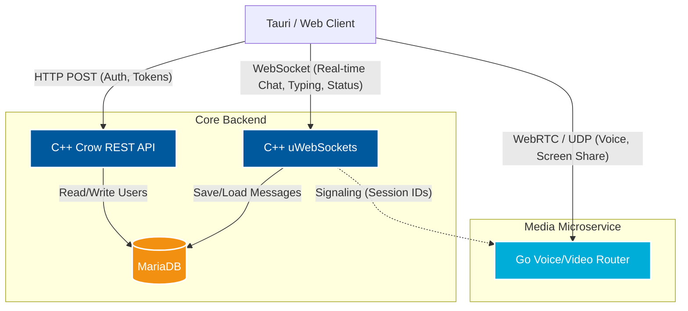

# Squirrel Communicator 🐿️

A high-performance, low-latency real-time chat application built with a powerful C++ backend and a modern frontend ecosystem.

You can explore a live working example of this project at: **[http://comm.sqrll.net/](http://comm.sqrll.net/)**

## 📸 Visual Showcase

---

## 🛠️ Architecture Diagram

GitHub natively renders the diagram below to show how the different microservices and clients communicate within the Squirrel ecosystem:

## ✨ Current Functionality

Squirrel Communicator currently offers the following features:
* **Real-time chat functionality:** Seamlessly send and receive messages between users in real time.
* **Login and Registration:** Secure user authentication and onboarding.
* **User search:** Easily locate and select other users to create new chats.
* **User status display:** See the online or offline status of other users.
* **Typing indicator:** View when other users are actively typing messages in real time.
* **Automatic message loading:** Messages are automatically loaded when scrolling to the top of the chat history.

## 🛠️ Architecture & Tech Stack

The architecture focuses on raw speed, concurrency, and ephemeral communication. It is divided into specialized services:

### Core Backend (This Repository)
* **C++:** The backbone of the project, ensuring bare-metal performance and efficient execution of critical logic.
* **CROWCPP:** Provides the REST API for transactional operations (user authentication, generating transfer tokens, data retrieval).
* **uWebSockets:** Handles the massive real-time event-driven WebSocket communication loop.
* **CMake:** Simplifies the build process and allows configuration across multiple platforms.

### Media & Voice
* **Go (Golang):** A dedicated, fast microservice handling media routing and ephemeral communication (like screen sharing and voice streams) using goroutines for high concurrency.

### Infrastructure
* **Docker:** Containerized setup ensuring a consistent deployment environment across the whole ecosystem.
* **Build Scripts:** Preconfigured build scripts for Windows and Linux are available in the `configsrv` directory.
* **Sentry:** Crash reporting and error monitoring via `sentry-native` (Crashpad backend), uploading minidumps for unhandled crashes.

## 🐛 Crash Reporting (Sentry)

The C++ backend integrates `sentry-native` to capture and report unhandled crashes
(`SIGSEGV`, `std::terminate`, `std::bad_alloc`, …) as minidumps with symbolicated
stack traces.

* **DSN & environment** are injected at runtime through environment variables
  (`SENTRY_DSN`, `SENTRY_ENVIRONMENT`) — never hardcoded in source.
* **Debug symbols** are uploaded automatically by the CI release workflow, keyed by
  the exact git commit hash that was compiled into the binary.
* **Crashpad handler** ships next to the server binary so minidumps are generated
  and uploaded even during a hard crash.

See [`docker/README.md`](docker/README.md) for the full Sentry configuration guide.

## 📦 Project Structure

The ecosystem consists of the following components:
* **SquirrelComm-Back:** The core C++ server (REST + WebSockets) - *This repository*.
* **Docker directory:** Deployment configurations and database schemas are located in the `docker` folder.
* **Squirrel Microservice - Voice:** The Go-based media router (Separate repository).
* **SquirrelComm-Front:** The modern client-side application.

> [!NOTE]
> The frontend client (**SquirrelComm-Front**) is currently kept as a private repository.

## 🐳 Running with Docker

The easiest and fastest way to get the project up and running locally is via Docker.

> [!IMPORTANT]
> You do not need to compile the C++ source code manually. The environment is configured to automatically pull pre-built Docker images generated by GitHub CI/CD workflows.

For detailed instructions, environment variables, and `docker-compose` usage, please refer to the dedicated Docker documentation:
👉 **[Read the Docker Setup Guide here](./docker/README.md)**

## 🚀 How to Build Manually

> [!WARNING]
> Manual compilation is only recommended if you intend to modify the C++ core or contribute to the project. For testing or hosting, please use the Docker setup above.

### Supported Platforms & IDEs
* **Linux:** Fedora 43 (Primary development environment), Debian 13 (Production setup).
* **Windows:** Latest (Packages managed via vcpkg).

> [!TIP]
> For the best development and debugging experience on Linux, we highly recommend using **JetBrains CLion**, fully tested and optimized on **Fedora**.

### Prerequisites
You will need the following tools to build and run the project locally from source:
* A C++ compiler supporting modern C++ standards (e.g., g++, clang, or Visual Studio 2022 build tools).
* View the `Dockerfile` in the `docker` directory for the exact package dependencies required on Linux.

### Build Instructions

1. **Clone the repository:** Ensure you initialize and download all required submodules.
2. **Use Build Scripts (Optional):** Preconfigured automation scripts are available in the `configsrv` directory:
   * For Windows, execute the `.bat` file.
   * For Linux, execute the `.sh` file.
3. **Manual CMake Build:**
   * Change to the `ProjectServer` directory where the core source files are located.
   * Create a build directory (e.g., `mkdir build && cd build`).
   * Configure and compile using CMake: `cmake .. && cmake --build .`
   * *Note: If you are using an IDE like CLion or Visual Studio, the build directories will be managed automatically by your environment.*

## ⚠️ Repository Limitations

* **Documentation:** Some features and modules may require further documentation.
* **Experimental Features:** Certain areas of the codebase may be under development or require testing in production-like environments.

## 🤝 Contributing

Contributions are welcome! Here's how you can contribute:
1. Fork the repository and create a feature branch.
2. Make your changes and add commits.
3. Open a pull request to propose your changes.

## 📄 License & About

For any usage or distribution inquiries, please contact the repository owner, **@Przemek2122**.
Feedback, ideas, and collaboration are warmly invited.
